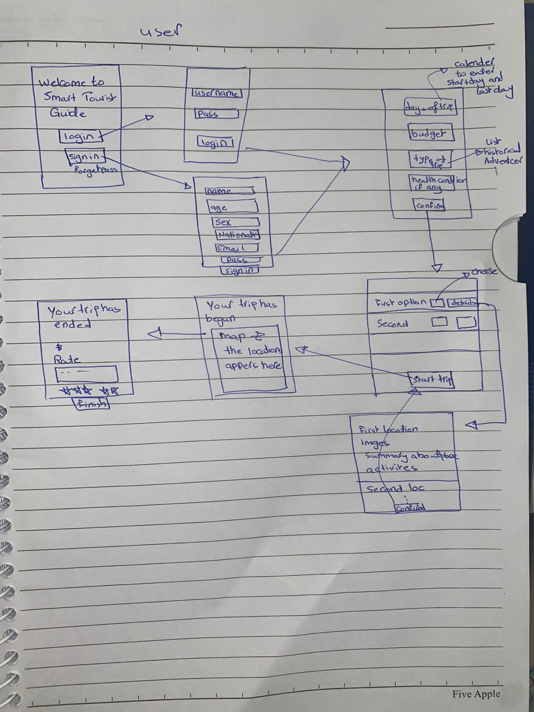
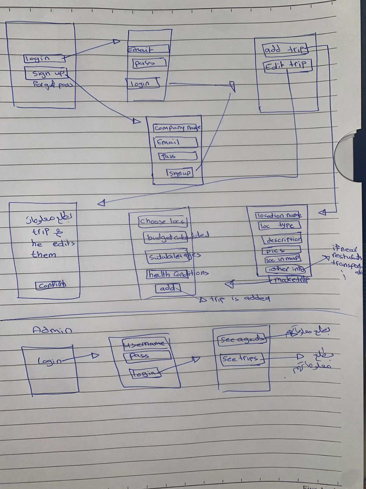
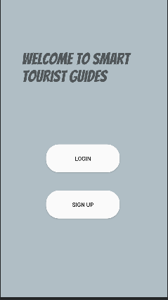
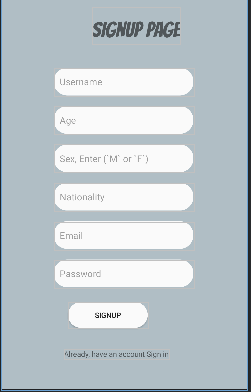
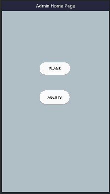
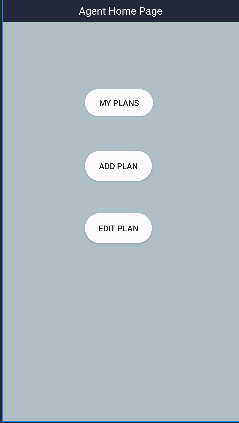
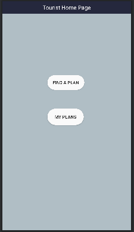
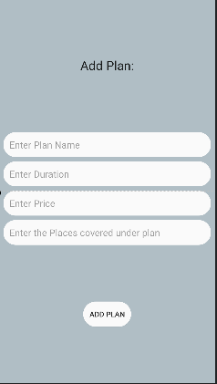
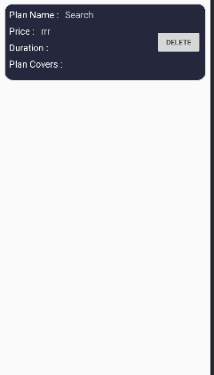
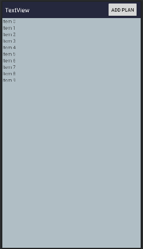

# Smart Tourist

Mobile Application On Android Platform, using java.  

## Table Of Content

<!-- TOC -->

- [Smart Tourist](#smart-tourist)
    - [Table Of Content](#table-of-content)
    - [Overview](#overview)
    - [Abstract](#abstract)
    - [Tools Needed](#tools-needed)
    - [Implementation Steps Day By Day](#implementation-steps-day-by-day)
        - [Estimated Time](#estimated-time)
        - [Day By Day](#day-by-day)

<!-- /TOC -->

## Overview

Guides to create an android application called `Smart Tourist`, thats help the tourist to find trip and keep in touch with agent also the trip details, like see locations will visited and other featuers like login and signup.
Also the agent can add a trip and fill the details and modify it or delete it and other feature like login withput sign up for the agents. The application provide admin features like create the accounts for agents and delete account ot modify it, other features like login, and track the trips.


---

## Abstract

The tourism in Jordan  has increased significantly. When tourists come to Jordan they are overwhelmed by the number of touristic places they can go, this makes deciding they’re trip difficult and time consuming.
Our App will help the tourist decide where to go according to their conditions and provide them with information about the trip they want to go.
The app is expected to improve the tourist experience when touring in Jordan through providing several facilities.

---


## Tools Needed

1- Android Studio.
2- Git.
3- GitHub.

---

## Implementation Steps Day By Day

### Estimated Time

Time : 14 days.

Start : (9/6/2022).

End: 22/6/2022.

Note: The time period will be split into two sections:

<details>
    <summary>First (9/6/2022 - 12/6/2022)</summary>

    Will design the most screens, Login screen and sign up, homeAgent, homeAdmin, homeTourist,...
    The 40% of work should be submitted at this period

</details>

<details>
    <summary>Second (13/6/2022 - 22/6/2022)</summary>
    
    Will implement and test all functionality.
</details>

---
<br>

### Day By Day

<br><br>

<details>
<summary> First Day - Thursday (9/6/2022)</summary>

Create a repository on github called [`smart-Tourist`](https://github.com/alkhatib99/smart-tourist).

Clone the repo,

```Shell
$ git clone git@github.com:alkhatib99/smart-tourist.git
```

Then change directory into the repo

```Shell
$ cd smart-tourist
```

Create an project inside the directory using android studio.

write scenario, imagine to how will be implemented, [Implementation First Scenario.](./Scenarios/first-scenario.md).

Sketch an prototyping using pen and paper:

- Tourist Prototyping:  
    - .

- Admin & Agent Prototyping:
    - .
 
 <br>

Start design the user interface and their logc depend on scenario .

- Main Screen:
    - 
- Signup Screen
    - 
- Login Screen
    - 

- Connect to firebase.
- Add firebase authentication to app.
- Add check current auth status.

</details>

<hr>

<details>
<summary> Second Day - Friday (10/6/2022)</summary>

- In today we start from writing some logic like:

    - Login And validation using FirebaseAuth and FirebaseUser and FirebaseDatabase.
    - Register Using Firebase.
    - 

- Using firebase our "users"  Database  will have the attributes:
    - username
    - age
    - sex 
    - nationality
    - email
    - password
    - role "tourist", "admin", "agent"

- In Scenario, we said if login successful the next activity depends on roles:
    - if role was "tourist", will go to TouristHomePage.
    - else if was "admin",will go to AdminHomePage
    - else if was "agent", will go to AgentHomePage

so, lets crreate the screens first:

- Create an 3 Activties at first: 
    - Admin Home Activity:
        * .
    - Agent Home Activity:
        * .
    - Tourist Home Activity:
        * 
</details>

<hr>

<details>
<summary> Third Day - Saturday (11/6/2022)</summary>

- Yesterday we create a basic three activities :
    1. Admin Home Page
    2. Agent Home Page
    3. Tourist Home Page
So, Let's start with the logic of it. All our implementation will be depend on senario, we have a part 2 of the scenario [please see it](./Scenarios/first-scenario.md). 

- After implement some functionality of the screens like navigate, we create a class called `Plan` that have an attribute of the plan, and to make save and edit more easier.

- The plans need to save it in list, and to show the list we need to define an recyclerView. So we use `Firestore.RecyclerView`, thats will help to save the plan object or item to firebase database.

- When we want to use list and recycler view we need to use something called `adapter`, so we create `PlanAdapter` and `PlanRecyclyerView`.

- The add plan page that using by agent to add a new plan, i need the information about the plan and then save it into `firebase.firestore`, so we design the `add plan screen` as below:
    - .

- Each plan will have some attributes and some values, how we will show :
    - we using an `CardView`, this Card View will contain the info about plan.
    - .

- We talk about the `RecyclerView`, and `FirestoreRecyclerView`, we design an activity that contains an `FirestoreRecyclerView`, that contain an items of type `CardView`, using the adapter will control the view and using ciewModel will be easier, see design below:
    - 


</details>

<hr>

---

* We shedualea meet at saturday 11/6/2022.